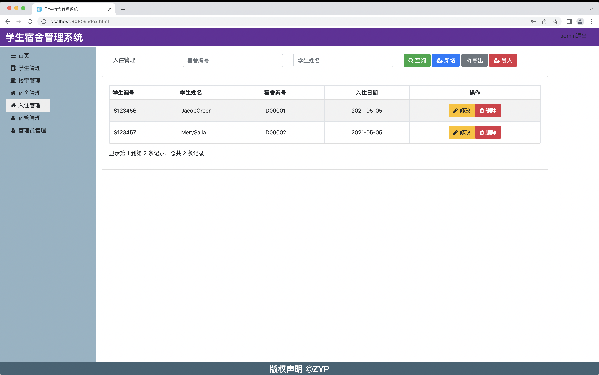
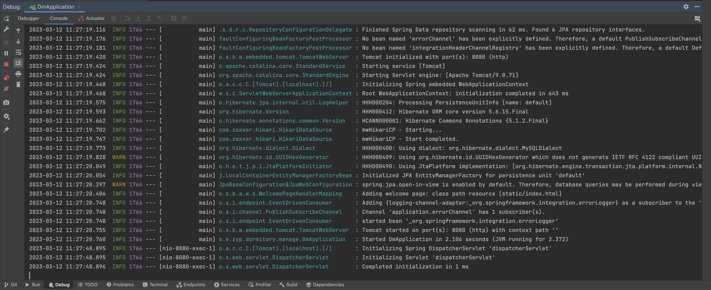

# dm

## 1.Description

Student Dormitory Management System

(Graduation Project)

## 2.Software Architecture

Java 20

Spring Boot Web

Spring Boot Data Jpa

Spring Boot Data Rest

SpringMVC

Bootstrap 4.6.2

Ajax

MySQL

hikariCP

JQuery

gijgo

font-awesome 4.7.0

bootstrap-table 1.21.3

sweetalert

## 3.Run

home

student

dormitory

building

live

dormitory_manager

admin

add Data

update Data

Export Excel

## 4.SetUp

1、clone code.

2、Java+maven environment is need，build by maven you can get：
dormitory-manage-0.0.3-SNAPSHOT.jar

(debug java project , your can skip this step)

3、init mysql database
run the script at your local mysql db by the script resource/init.sql
(db is mysql,default 127.0.0.1:3306, root/11111111, you can set password by yourself)

4、run the project

A）run this commond `java -jar dormitory-manage-0.0.3-SNAPSHOT.jar`

B）compiled project bt maven，execute Java Application：
`sut.edu.zyp.dormitory.manage.DmApplication`

it is succeeded when you see logs like this：

browse http://localhost:8080

default login account: admin/admin

