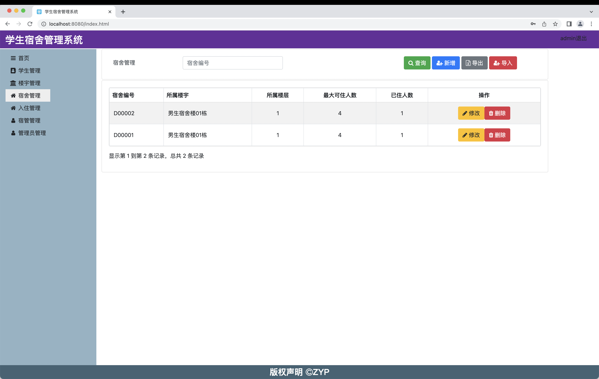
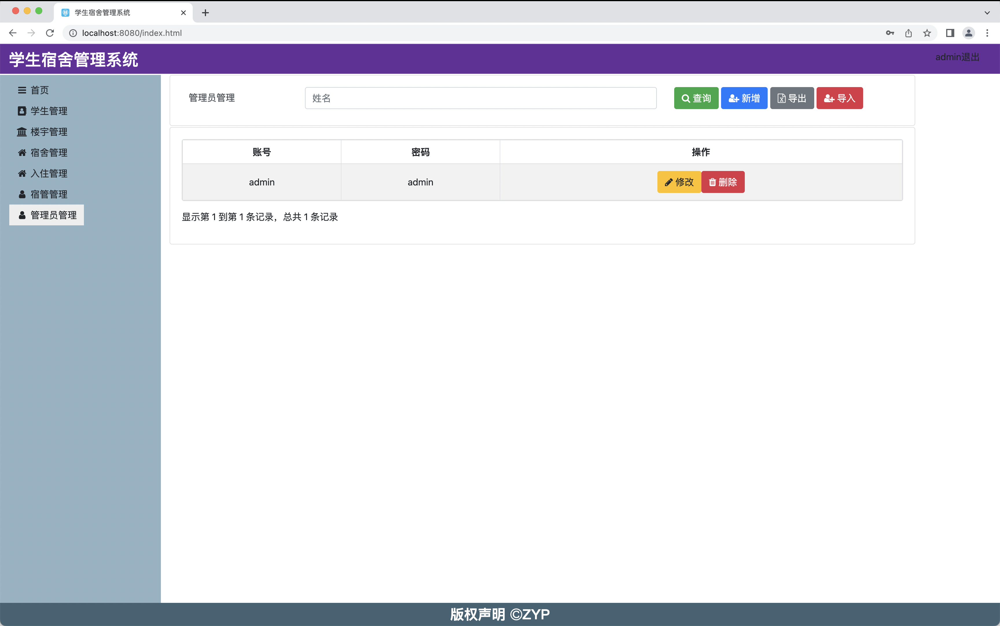

# dm-学生宿舍管理系统

## 介绍

学生宿舍管理系统

## 架构说明

Spring Boot Web

Spring Boot Data Jpa

Spring Boot Data Rest

SpringMVC

Bootstrap 4

Ajax

MySQL

hikariCP

JQuery

gijgo

font-awesome

bootstrap-table

sweetalert

## 运行

首页

学生

宿舍

楼宇

入住

宿管

管理员
