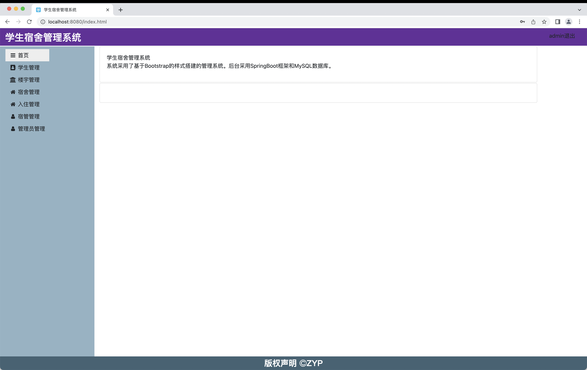

# dm-学生宿舍管理系统

## 介绍

学生宿舍管理系统

(毕业设计)

## 架构说明

Java 20

Spring Boot Web

Spring Boot Data Jpa

Spring Boot Data Rest

SpringMVC

Bootstrap 4.6.2

Ajax

MySQL

hikariCP

JQuery

gijgo

font-awesome 4.7.0

bootstrap-table 1.21.3

sweetalert

## 运行

首页

学生

宿舍

楼宇

入住

宿管

管理员

新增数据

更新数据

导出Excel

## 安装

1、克隆代码到本地

2、本地需要Java+maven环境，通过maven构建
得到：dormitory-manage-0.0.3-SNAPSHOT.jar

调试模式可以跳过此步骤

3、初始化数据库
将源码resource 中的init.sql执行到本地mysql数据库
(源码中默认本地数据库,mysql,127.0.0.1:3306, root/11111111, 实际情况按照自己需要设置密码)

4、运行

A）可以通过`java -jar dormitory-manage-0.0.3-SNAPSHOT.jar`运行

B）编译Java完成后，直接执行Java Application：
`sut.edu.zyp.dormitory.manage.DmApplication`

日志如下图表示启动成功：

打开浏览器 http://localhost:8080

默认登录 admin/admin

